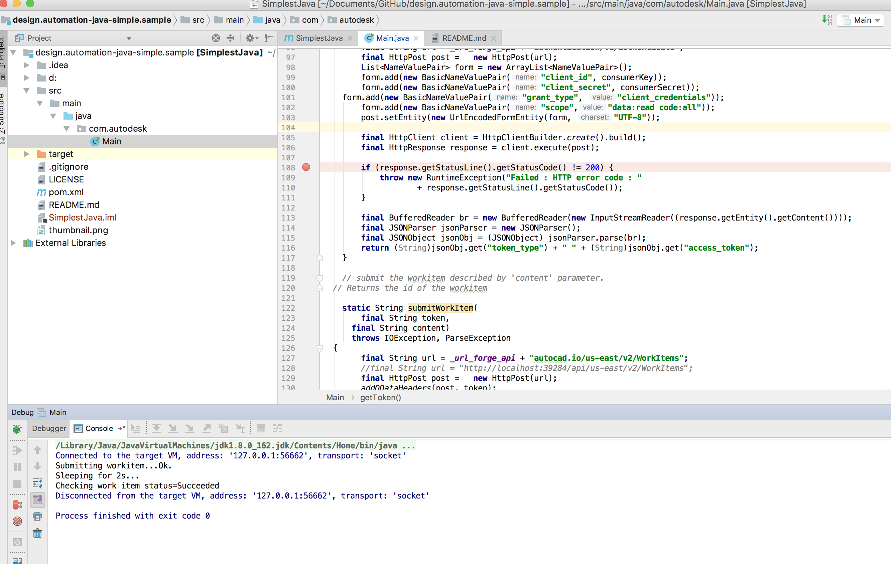

# design.automation-java-simple.sample

[](http://www.odata.org/documentation/)
[](http://developer.autodesk.com/)
[](https://www.jetbrains.com/idea/)
[]
[](http://opensource.org/licenses/MIT)

## Description

This is a simple Java client that exercises the predefined `PlotToPDF` activity.
It issues direct HTTP requests to call the [Autodesk Forge Design Automation API](https://developer.autodesk.com/en/docs/design-automation/v2/overview/).

## Thumbnail


## Setup

### Dependencies
* Download and install [IntelliJ Community or Ultimate](http://www.jetbrains.com/idea/). In the latest test, the version is IntelliJ Community 2017.3 .

### Prerequisites
1. **Forge Account**: Learn how to create a Forge Account, activate subscription and create an app at [this tutorial](http://learnforge.autodesk.io/#/account/). Make sure to select the service **Design Automation**.
2. Make a note with the credentials (client id and client secret) of the app.


## Running locally

1. Set enviroment variables.

* Mac OSX/Linux (Terminal). Note: to let IntelliJ refresh with the updated enviroment variables, perform

```
    open -a "IntelliJ IDEA CE" to start IntelliJ Community
```
OR
```
    open -a "IntelliJ IDEA" to start IntelliJ Ultimate
```

```
    export FORGE_CLIENT_ID=<<YOUR CLIENT ID FROM FORGE DEVELOPER PORTAL>>
    export FORGE_CLIENT_SECRET=<<YOUR FORGE CLIENT SECRET>>
```

* Windows (command line)

```
    set FORGE_CLIENT_ID=<<YOUR CLIENT ID FROM FORGE DEVELOPER PORTAL>>
    set FORGE_CLIENT_SECRET=<<YOUR FORGE CLIENT SECRET>>
```

2. In IntelliJ, open the project as Maven oriject
3. Configure with available JAVA enviroment
4. Run or debug src/Main, the work item will be posted, and status is shown in the console.

  


## Known Issues
* IntelliJ IDEA might not get updated enviorment varaiables on Mac OS. The solution is described at [fix PATH environment variable for IntelliJ IDEA on Mac OS X](http://depressiverobot.com/2016/02/05/intellij-path.html)

## Further Reading
* [Design Automation API help](https://forge.autodesk.com/en/docs/design-automation/v2/developers_guide/overview/)
* [ Intro to Design Automation API Video](https://www.youtube.com/watch?v=GWsJM344CJE&t=107s)
* [convert a DWG to a PDF file](https://developer.autodesk.com/en/docs/design-automation/v2/tutorials/convert-dwg-to-pdf/)

## License

These samples are licensed under the terms of the [MIT License](http://opensource.org/licenses/MIT). Please see the [LICENSE](LICENSE) file for full details.


## Authors

- Jonathan Miao
- Version 2.0.0 by Jeremy Tammik,
[The Building Coder](http://thebuildingcoder.typepad.com),
[ADN](http://www.autodesk.com/adn)
[Open](http://www.autodesk.com/adnopen),
[Autodesk Inc.](http://www.autodesk.com)
 migrated to Design Automation API on November 7-8, 2016.
